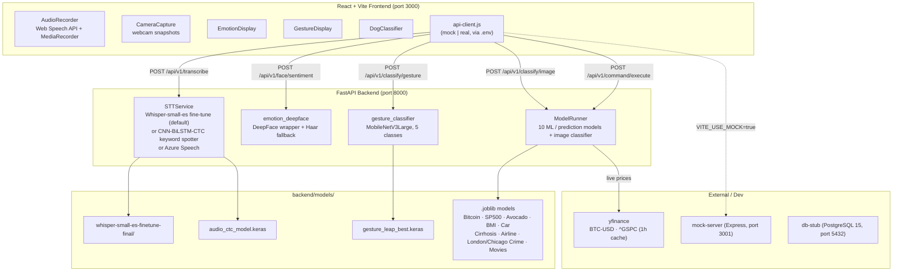

# TravisTEC

Multimodal AI assistant: voice-command navigation, hand-gesture recognition, facial-emotion detection, an image classifier, and **10 machine-learning prediction models** — served by a FastAPI backend with a React/Vite frontend and orchestrated with Docker Compose.

Built as a university project, then audited and refined into a production-quality DS/ML portfolio piece. See [`AUDIT.md`](AUDIT.md) for the full list of issues found and fixed.

[](https://github.com/ContraInfinito/travistec/actions/workflows/ci.yml)

---

## Architecture



## Stack

| Layer | Technology |
|---|---|
| Frontend | React 19, Vite 7, React Router 7, Axios |
| Backend | FastAPI, Python 3.11, Uvicorn |
| Voice (STT) | Fine-tuned Whisper-small-es (default) · custom CNN-BiLSTM-CTC keyword spotter · Azure Speech (optional) |
| Gesture | Keras / MobileNetV3Large transfer learning (5 gesture classes) |
| Emotion | DeepFace (integrated wrapper, not trained from scratch) + Haar-cascade fallback |
| ML models | scikit-learn RandomForest (regression + classification), 5-fold CV + Dummy baselines |
| Live data | yfinance (BTC-USD, ^GSPC), 1-hour in-memory cache |
| Dev / Packaging | Express mock server, PostgreSQL stub, Docker Compose, GitHub Actions CI |

> **Note on framing (honesty matters):** the emotion feature is an *integrated DeepFace wrapper*, not a model trained here. The voice "speech recognition" component is a *keyword spotter* over a fixed command vocabulary, not general-purpose ASR. See [`AUDIT.md`](AUDIT.md).

---

## Project structure

```
TravisTEC/
├── backend/                      FastAPI + ML
│   ├── app.py                    API entrypoint (all endpoints)
│   ├── config.py
│   ├── services/
│   │   ├── model_runner.py       Loads & runs .joblib / Keras models
│   │   ├── stt_service.py        Speech-to-text (whisper | ctc | azure)
│   │   ├── emotion_deepface.py   Emotion detection (DeepFace + Haar fallback)
│   │   ├── emotion_local_onnx.py Alternative FER+ ONNX detector
│   │   ├── gesture_classifier.py MobileNetV3Large gesture model
│   │   └── gesture_mediapipe.py  Alternative MediaPipe detector
│   ├── scripts/                  train_*.py and run_*/smoke tests
│   ├── models/                   Trained artifacts (gitignored; see below)
│   ├── datasets/                 Training data (large files gitignored)
│   └── requirements.txt
├── frontend-react/               React 19 + Vite 7
│   └── src/
│       ├── pages/                Home.jsx · Capture.jsx · Results.jsx
│       ├── components/           CameraCapture · AudioRecorder · EmotionDisplay
│       │                         GestureDisplay · DogClassifier
│       └── services/api-client.js
├── mock-server/                  Express mock API for frontend-only dev
├── notebooks/                    Data exploration & model-training notebooks
├── postman/                      Postman collection
├── docs/charts/                  Feature-importance plots (generated by trainers)
├── .github/workflows/ci.yml      Lint + model smoke tests + ESLint
└── docker-compose.yml            Orchestrates backend + frontend + mock + db
```

> Trained model artifacts (`*.joblib`, `*.keras`, `*.h5`, Whisper weights) are **gitignored** because they're large. The backend loads whatever is present in `backend/models/` at startup and degrades gracefully when a model is missing.

---

## Quick start

### Option 1 — Docker Compose (recommended)

```powershell
git clone https://github.com/ContraInfinito/travistec.git
cd travistec

# Optional: only needed if you use Azure Speech for STT
copy backend\.env.example backend\.env

docker-compose up --build
```

| Service | URL |
|---|---|
| Frontend (React) | http://localhost:3000 |
| Backend (FastAPI) | http://localhost:8000 · docs at `/docs` |
| Mock server | http://localhost:3001 |
| PostgreSQL stub | localhost:5432 |

### Option 2 — Local development

**Backend:**
```powershell
cd backend
python -m venv venv
.\venv\Scripts\Activate.ps1
pip install -r requirements.txt
python app.py            # serves on http://localhost:8000
```

**Frontend:**
```powershell
cd frontend-react
npm install
npm run dev              # serves on http://localhost:3000
```

The first backend startup downloads model weights for DeepFace and loads the Whisper/Keras models, so it can take a minute. Endpoints that depend on a missing model return a clear error rather than crashing.

---

## API reference

Base URL: `http://localhost:8000` · interactive docs at `/docs`.

### Core / multimodal

| Method | Path | Body | Purpose |
|---|---|---|---|
| `GET`  | `/api/health` | — | Service health (STT, ModelRunner, face detector) |
| `GET`  | `/api/v1/models` | — | List loaded model names |
| `POST` | `/api/v1/transcribe` | `audio` (multipart) | Speech-to-text |
| `POST` | `/api/v1/face/sentiment` | `image` (multipart) | Emotion detection (DeepFace) |
| `POST` | `/api/v1/classify/gesture` | `image` (multipart) | Hand-gesture classification |
| `POST` | `/api/v1/classify/image?model=...` | `image` (multipart) | Image classifier (default: dog breeds) |
| `POST` | `/api/v1/command/execute` | `{text, task, params}` | Run a parsed voice command |
| `POST` | `/api/process` | `{text}` | Quick text → model mapping |

### Prediction models

| Method | Path | Example body |
|---|---|---|
| `POST` | `/api/v1/predict/bitcoin` | `{ "years": 1 }` |
| `POST` | `/api/v1/predict/sp500` | `{ "days": 30 }` |
| `POST` | `/api/v1/predict/avocado` | `{ "months": 3 }` |
| `POST` | `/api/v1/predict/bmi` · `/api/v1/bmi` | `{ "height": 1.75, "weight": 70, "age": 30 }` |
| `POST` | `/api/v1/predict/car` | `{ "year": 2015, "km": 50000 }` |
| `POST` | `/api/v1/predict/cirrhosis` | `{ "age": 50, "bilirubin": 1.5 }` |
| `POST` | `/api/v1/predict/airline` | `{ "month": 6, "day": 15, "distance": 500, "origin": "IAD", "dest": "TPA", "carrier": "WN" }` |
| `POST` | `/api/v1/predict/london` | `{ "day": "viernes" }` |
| `POST` | `/api/v1/predict/chicago` | `{ "day": "viernes", "month": 11 }` |
| `POST` | `/api/v1/predict/movie` | `{ "top_k": 5, "genre": "Drama", "year": 1994 }` |
| `POST` | `/api/v1/models/{name}` | `{ "features": [...] }` or `{ "params": {...} }` |

### Metadata helpers

| Method | Path | Returns |
|---|---|---|
| `GET` | `/api/v1/meta/movies` | Available genres & years |
| `GET` | `/api/v1/meta/airports` | Origins / destinations / carriers |
| `GET` | `/api/v1/airline/metadata` | Airport & carrier codes with names |

**Bitcoin / SP500 / Avocado use live data.** On each request, `ModelRunner` fetches recent prices via `yfinance` (BTC-USD, ^GSPC) or the avocado dataset, builds the same lag/rolling features the model was trained on, and runs real inference — results are cached for 1 hour. See [`AUDIT.md`](AUDIT.md) for the before/after on this fix.

A full Postman collection lives in [`postman/`](postman/).

---

## Configuration

### Backend (`backend/.env`)

All variables are **optional** — the default STT backend (`local_whisper`) and emotion detector need no keys.

```env
# Speech-to-text backend: local_whisper (default) | local_ctc | azure
STT_SERVICE=local_whisper

# Only required when STT_SERVICE=azure
AZURE_SPEECH_KEY=
AZURE_SERVICE_REGION=

# DeepFace face-detector backend (opencv | retinaface | mtcnn | ssd ...)
EMOTION_DETECTOR_BACKEND=opencv

# Car-price unit conversion (dataset prices are in lakhs by default)
CAR_PRICE_UNIT_MULTIPLIER=100000
CAR_PRICE_TO_USD_RATE=        # optional: USD per rupee
```

### Frontend (`frontend-react/.env`)

```env
VITE_API_URL=http://localhost:8000     # real backend
VITE_USE_MOCK=false                    # true → use the Express mock server
VITE_MOCK_API_URL=http://localhost:3001
```

---

## Machine-learning models

Each supervised model is trained by a script in `backend/scripts/train_*.py`. Every trainer now reports **5-fold cross-validation against a Dummy baseline** and writes a feature-importance chart to `docs/charts/`.

| Model | Type | Target | Trainer |
|---|---|---|---|
| Bitcoin price | Regression | Future BTC price (live features) | `train_bitcoin_model.py` |
| S&P 500 | Regression | Future index value (live features) | `train_sp500_model.py` |
| Avocado price | Regression | Future avg. price | `train_avocado_model.py` |
| BMI / body-fat | Regression | Body-fat % | `train_bmi_model.py` |
| Car price | Regression | Selling price | `train_car_price.py` |
| Cirrhosis stage | Classification | Stage 1–4 | `train_cirrhosis_model.py` |
| Airline delay | Classification | Delayed >15 min | `train_airline_delay_model.py` |
| London crime | Regression | Crimes/day per borough | `train_london_crime_model.py` |
| Chicago crime | Regression | Incidents/day | `train_chicago_crime_model.py` |
| Movie recommender | Content-based | Top-k recommendations | `train_movie_recommender.py` |

Deep-learning components: **gesture** (`train_leap_gesture.py`, MobileNetV3Large) and **voice CTC** (`train_audio_ctc.py`, CNN-BiLSTM-CTC with 80/20 split + WER metric).

```powershell
cd backend
python scripts\train_bmi_model.py        # prints CV vs baseline, writes chart
python scripts\run_model_smoke_tests.py  # loads & exercises every saved model
```

---

## Testing & CI

GitHub Actions ([`.github/workflows/ci.yml`](.github/workflows/ci.yml)) runs three jobs in parallel on every push/PR:

1. **lint-backend** — flake8 over `backend/`
2. **model-smoke-tests** — loads every present model, verifies training scripts parse
3. **lint-frontend** — ESLint over `frontend-react/`

Local smoke tests:
```powershell
cd backend
python scripts\run_model_smoke_tests.py     # all saved models
python scripts\run_smoke_emotion_simple.py  # emotion detector
python scripts\smoke_test_stt.py            # speech-to-text

cd ..\frontend-react
npm run lint
npm run build
```

---

## Mock vs. real backend

For frontend work without ML dependencies or Azure, point the frontend at the Express mock server:

```env
# frontend-react/.env
VITE_USE_MOCK=true
VITE_MOCK_API_URL=http://localhost:3001
```

```powershell
cd mock-server
npm install
npm start          # serves canned responses on http://localhost:3001
```

The mock implements the core endpoints (`/api/health`, `/api/v1/transcribe`, `/api/v1/face/sentiment`, `/api/v1/command/execute`, `/api/v1/bmi`, plus stock/movie stubs).

---

## Frontend components

| Component | Responsibility |
|---|---|
| `<CameraCapture />` | Webcam stream with automatic (every 2s) and manual snapshots |
| `<AudioRecorder />` | Web Speech API + MediaRecorder, parses commands to `{task, params}` |
| `<EmotionDisplay />` | Renders emotion distribution + dominant emoji |
| `<GestureDisplay />` | Shows predicted gesture + confidence |
| `<DogClassifier />` | Uploads an image to the dog-breed image classifier |

Routes: `/` (Home), `/capture` (live capture), `/results` (session summary).

---

## Notebooks

`notebooks/` contains the exploration and training history:

- `01_data_exploration.ipynb` — dataset EDA
- `02_model_training.ipynb` — baseline supervised models
- `03_advanced_model_training.ipynb` — refined models
- `train_audio_ctc_colab.ipynb` — CTC voice model (Colab/GPU)

---

## License

MIT © 2025 Mathew Carballo — see [`LICENSE`](LICENSE).
